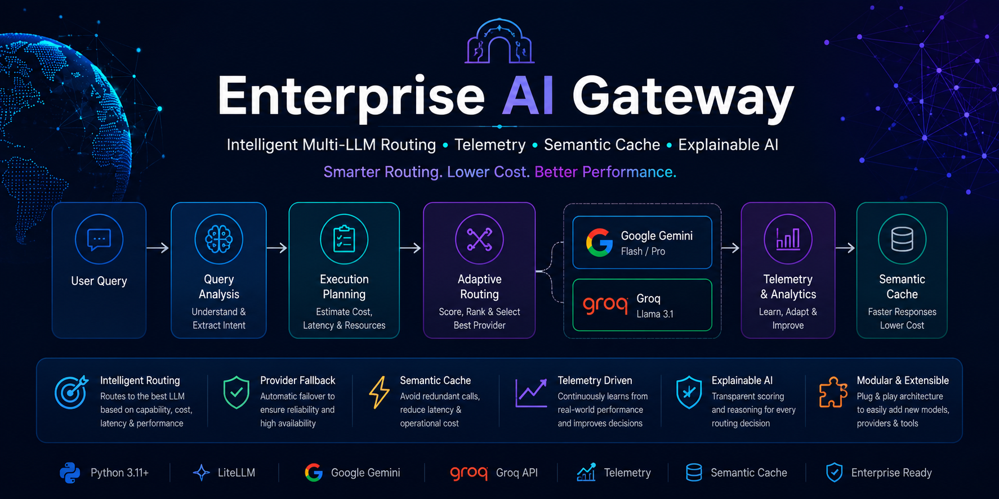
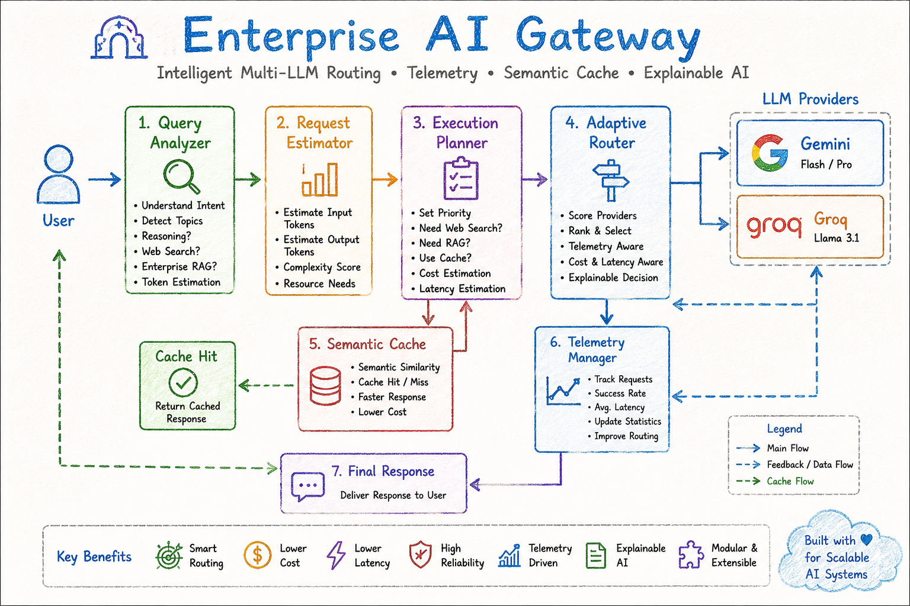

<p align="center">
  
</p>

# 🚀 Enterprise AI Gateway

> An intelligent, modular AI Gateway that analyses user queries, plans execution, adaptively routes requests across multiple LLM providers, leverages telemetry for smarter decisions, and provides explainable routing with enterprise-ready architecture.


---

# 📖 Overview

Enterprise AI Gateway is designed to act as an intelligent middleware between users and multiple Large Language Models (LLMs).

Instead of directly sending every request to a single model, the gateway:

- Analyses the incoming query
- Estimates execution requirements
- Creates an execution plan
- Selects the most suitable AI provider
- Uses telemetry to improve routing decisions
- Falls back to alternate providers on failure
- Supports semantic caching and enterprise knowledge retrieval
- Explains every routing decision

The project demonstrates how enterprise-grade AI orchestration systems can be built using clean software engineering principles.

---

# ✨ Features

## 🧠 Intelligent Query Analysis

- Prompt analysis
- Topic detection
- Complexity estimation
- Token estimation
- Multi-question detection
- Reasoning detection
- Enterprise RAG detection
- Web search detection

---

## 📋 Execution Planning

Automatically generates an execution plan containing:

- Cache usage
- Web search requirements
- Enterprise RAG requirements
- Estimated latency
- Estimated cost
- Estimated input/output tokens
- Execution priority

---

## 🎯 Adaptive Routing

The gateway intelligently chooses the best provider based on:

- Capability
- Reasoning strength
- Cost efficiency
- Historical performance
- Latency prediction
- Telemetry statistics

Supported Providers:

- Google Gemini Flash
- Google Gemini Pro
- Groq (Llama 3.1)

---

## 📊 Telemetry

Tracks provider performance including:

- Request count
- Success rate
- Average latency
- Predicted latency
- Provider statistics

The router continuously adapts using historical telemetry.

---

## ⚡ Semantic Cache

Supports semantic caching to avoid unnecessary LLM calls.

Benefits include:

- Lower latency
- Reduced API usage
- Lower operational cost
- Faster responses

---

## 🔄 Provider Fallback

If the selected provider fails (quota exceeded, timeout, etc.), the gateway automatically switches to another available provider.

---

## 🔍 Explainable Routing

Every routing decision includes:

- Routing score
- Score breakdown
- Routing explanation
- Expected latency
- Selected model
- Selected provider

---

## 🛠 Debug Console

Built-in debugging utilities display:

- Query Analysis
- Execution Plan
- Routing Summary
- Semantic Cache Status
- Execution Timeline
- Final Execution Report

---

# 🏗 Architecture

<p align="center">
  
</p>

<p align="center">
  <sub>
    The Enterprise AI Gateway follows a modular, provider-agnostic architecture.
    A user request is analysed, transformed into an execution plan, adaptively
    routed to the most suitable LLM provider, and continuously improved through
    telemetry and semantic caching.
  </sub>
</p>

## 📂 Project Structure

```text
enterprise-ai-gateway/

├── 📂 src
│   ├── 📂 analyzer
│   ├── 📂 planner
│   ├── 📂 router
│   ├── 📂 providers
│   ├── 📂 telemetry
│   ├── 📂 cache
│   ├── 📂 gateway
│   ├── 📂 utils
│   └── 📄 schemas.py
│
├── 📂 tests
├── 📂 assets
│   ├── 🖼️ banner.png
│   └── 🖼️ architecture.png
│
├── 📄 app.py
├── 📄 requirements.txt
└── 📄 README.md
```

# 🔄 Execution Pipeline

```
User Query
      │
      ▼
Query Analysis
      │
      ▼
Request Estimation
      │
      ▼
Execution Planning
      │
      ▼
Semantic Cache
      │
      ├── Cache Hit
      │      │
      │      ▼
      │   Return Response
      │
      ▼
Adaptive Routing
      │
      ▼
LLM Provider
      │
      ▼
Telemetry Update
      │
      ▼
Gateway Response
```

---

# 🧩 Design Principles

- Modular Architecture
- Separation of Concerns
- Explainable AI Routing
- Provider Agnostic Design
- Extensible Components
- Enterprise Scalability
- Clean Code
- Type Safety

---

# 📈 Current Capabilities

| Module | Status |
|---------|--------|
| Query Analyzer | ✅ |
| Request Estimator | ✅ |
| Execution Planner | ✅ |
| Adaptive Router | ✅ |
| Provider Scorer | ✅ |
| Provider Ranker | ✅ |
| Provider Factory | ✅ |
| Semantic Cache | ✅ |
| Telemetry | ✅ |
| Explainable Routing | ✅ |
| Provider Fallback | ✅ |
| Debug Printer | ✅ |

---

# 🧪 Technologies Used

- Python
- Pydantic
- LiteLLM
- Google Gemini API
- Groq API
- Streamlit *(Upcoming)*
- Git
- GitHub

---

# 🚀 Getting Started

## Clone the repository

```bash
git clone https://github.com/Milind-Muravane/enterprise-ai-gateway.git

cd enterprise-ai-gateway
```

## Install dependencies

```bash
pip install -r requirements.txt
```

## Configure environment

Create a `.env` file:

```env
GEMINI_API_KEY=your_key
GROQ_API_KEY=your_key
```

## Run

```bash
python app.py
```

---

# 📌 Roadmap

## ✅ v1.0

- Query Analysis
- Request Estimation
- Execution Planning
- Adaptive Routing
- Multi-Provider Support
- Semantic Cache
- Telemetry
- Explainable Routing
- Provider Fallback
- Debug Printer

---

## 🚧 v1.1

- Streamlit Dashboard
- Interactive Visualisations
- Provider Metrics
- Chat Interface

---

## 🔮 v2.0

- MCP Integration
- Multi-Agent Workflows
- Dynamic Routing Policies
- Long-Term Memory
- Plugin Architecture
- Advanced Analytics

---

# 🤝 Contributing

Contributions, suggestions, and feature requests are welcome.

Feel free to fork the repository and submit a pull request.

---

# 📜 License

This project is licensed under the MIT License.

---

# 👨‍💻 Author

**Milind Muravane**

B.Tech Computer Science (AI & Data Science)  
MIT World Peace University

B.S. in Data Science (Online Degree Programme -- Currently at Diploma level)
IIT Madras

Passionate about Artificial Intelligence, Machine Learning, Agentic AI, and Enterprise AI Systems.

---

⭐ If you found this project interesting, consider giving it a star!
